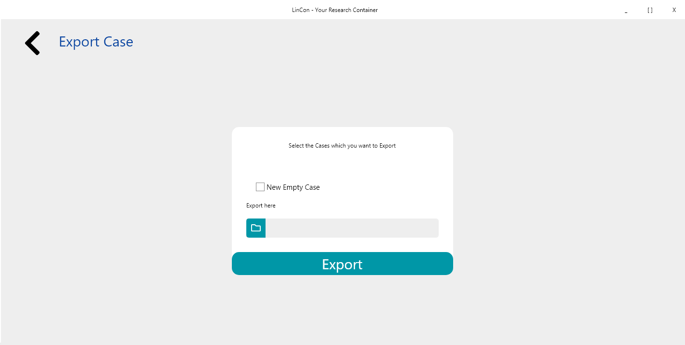
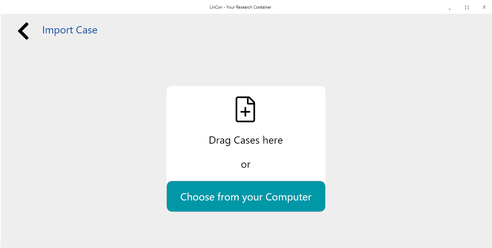
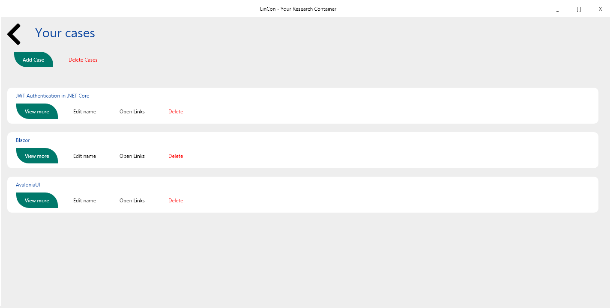
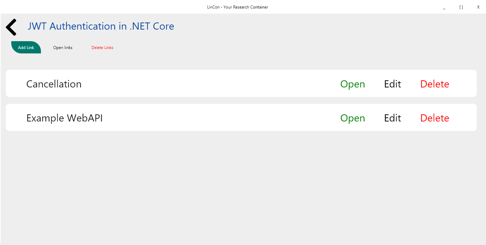

# LinCon

A Cross-Platform Research Container tool I built for myself to manage articles and useful links I found on the Internet.
Built with AvaloniaUI and ReactiveUI on .NET Core 

## Functionality

Application allows you to create named groups of links - so called Cases, and open them in the Browser at once or separately.

You can export your Cases from the Database to *.lc file which is just a JSON file.

Import is also possible from existing *.lc file and any other extension - but only from *.lc or *.json it will be possible to retrieve the Custom Names that you assigned.

You can also set LinCon as default application for working with *.lc file to open links contained in them in the Browser by double clicking these files.

# Images

# Credits

I'm very grateful to Kamil Gloc.
He's a Graphic Designer that created a Layouts for LinCon.
This Application could have been much less organized because of my lack of UI design skills.

You can find more of his works here:

https://www.facebook.com/Kamil-Gloc-Graphic-Designer-850885198419471/

https://dribbble.com/Kamil_Gloc
